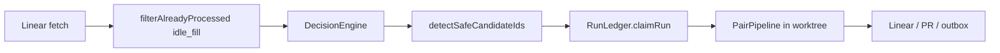

# Architecture

> 이 문서는 다른 에이전트가 이 레포에 빠르게 온보딩하기 위한 구조 지도다.
> 사람 독자용 개요는 [README.md](README.md)를 참조.
> 실행 상태·리스·복구 불변식은 [docs/DURABLE_AUTONOMY.md](docs/DURABLE_AUTONOMY.md).

## 시스템 개요

OpenSwarm은 Linear(또는 로컬 이슈 스토어)에서 일을 집어와 worktree-isolated worker를 돌리는 자율 오케스트레이터다. 진실의 축은 둘이다.

- **Intent**: Linear / local tracker (상태, 토론, Done/Canceled).
- **Execution**: `~/.openswarm/automation.db` (`RunLedger`) — claim, lease, attempt, fileScope, outbox.

Heartbeat(`AutonomousRunner`)가 이슈를 가져오고, `filterAlreadyProcessed`로 park/backoff를 열며, `DecisionEngine`이 실행 가능한 카드를 고르고, `detectSafeCandidateIds` + `RunLedger.claimRun`이 슬롯을 채운 뒤 `PairPipeline`이 Worker→Reviewer→Tester→Documenter를 돌린다.

## 디렉토리 트리 (주요)

```
src/
  automation/     — heartbeat, RunLedger, durable coordinator, PR processor
  orchestration/  — DecisionEngine, TaskScheduler, conflictDetector, writeScope
  taskState/      — JSON projection + getTaskReadiness / dependency reconcile
  adapters/       — provider adapters (codex-responses, openrouter, …)
  agents/         — pairPipeline, worker/reviewer/tester/documenter
  linear/         — Linear fetch (Todo/In Progress/In Review/Backlog)
  core/           — config Zod schema, service wiring
  support/        — worktree, ephemeral paths, dashboard, time window
  cli/            — openswarm work / review / pr
docs/
  DURABLE_AUTONOMY.md — ledger states, leases, reconcile
  DOD_CONTRACT.md     — sandbox-achievable completion criteria
```

## 모듈 책임 (module → responsibility)

| 모듈 | 책임 | 진입점 | 의존 |
|------|------|--------|------|
| `automation/autonomousRunner.ts` | 5분 heartbeat, idle_fill, enqueue | `heartbeat` / `heartbeatParallel` | DecisionEngine, RunLedger, scheduler |
| `automation/runLedger.ts` | durable claim/lease/transition | `claimRun`, `resumeNeedsHuman`, `markReady` | `runLedgerScope.ts` |
| `orchestration/decisionEngine.ts` | 선택·우선순위·umbrella/terminal 게이트 | `heartbeatMultiple` | `taskState/store.getTaskReadiness` |
| `orchestration/conflictDetector.ts` | 예측 write-scope 비교 | `detectFileConflicts`, `describeScopeConflict` | `conflictScope.ts` |
| `orchestration/taskScheduler.ts` | 슬롯·큐·worktree 병렬 | `enqueue`, `runAvailable` | worktreeManager |
| `taskState/store.ts` | 의존성  readiness, Linear projection | `getTaskReadiness`, `reconcileDependencyBlockers` | Linear lookup |
| `support/worktreeEphemeral.ts` | `.venv` / `.test_venv` / pytest-local | `citedPathsAreEphemeral` | publication fence |
| `agents/pairPipeline.ts` | Worker↔Reviewer 루프 | `run` | adapters |

## 데이터 흐름



Admission under `unknownScopeAdmission: admit` (default, vela):

1. `includeBacklog: true` — Backlog is a queue.
2. `idle_fill` lifts `NEEDS_HUMAN` / `RETRY_AT` / legacy backoff when Linear still wants the card.
3. Predicted file overlap does **not** defer. Worktrees isolate; merge later.
4. Still skipped: Linear Done/Canceled, parent/EPIC umbrellas, live `CLAIMED`/`EXECUTING` leases, unresolved deps, unmapped/disabled projects.

`serialize` restores Codex-era fail-closed overlap holds.

## 주요 타입·스키마

- `TaskItem` (`orchestration/decisionEngine.ts`) — `linearState`, `fileScope`, `blockedBy`, `explicitDispatch`.
- `RunState` (`automation/runLedgerTypes.ts`) — `READY`…`DONE` plus `RETRY_AT`, `NEEDS_HUMAN`, `NEEDS_RECONCILE`.
- `ParkResumeTrigger` — `idle_fill` | `explicit_dispatch` | `tracker_todo` | `sandbox_quarantine_dispatch` | `unspecified`.
- `UnknownScopeAdmission` — `'admit' | 'serialize'`.
- Config: `src/core/config.ts` `AutonomousConfigSchema` (`includeBacklog` default true, `unknownScopeAdmission` default admit).

## 확장 지점

- 새 provider: `src/adapters/` + `core/config` adapter enum.
- Admission 정책: `runLedgerScope.admitsConflictScope`, `conflictDetector.detectFileConflicts`, `autonomousRunner.detectSafeCandidateIds` — 세 곳이 같은 정책을 읽어야 한다.
- Linear fetch 상태: `src/linear/linear.ts` `getMyIssues` (이미 Backlog 포함).
- Ephemeral 경로: `src/support/worktreeEphemeral.ts`.

## 금기 / 지뢰

- **vela compose는 이미지 태그를 pin한다.** `docker build`만으로는 recreate 안 됨. `docker-compose.yml`의 `openswarm:vela-YYYYMMDD-HHMM-amd64`를 바꾸고 `up -d --no-deps openswarm`.
- **`vela-build.sh <sha>`는 `origin/main`만 fetch한다.** PR SHA는 `builds/4e8ba24`에서 `git fetch origin <branch>` 먼저.
- **PR SHA를 돌리는 동안 `.last-deployed-sha`는 `origin/main` tip을 유지**하지 않으면 autodeploy cron이 main으로 롤백한다.
- **`unknownScopeAdmission: admit`를 heartbeat만 바꾸고 claim 게이트를 안 바꾸면** 큐에는 들어가고 `claimRun`이 null — 슬롯이 다시 빈다.
- **`isActionableLinearState(state)` 헬퍼 기본은 Backlog park.** 엔진/config 기본은 `includeBacklog: true`. `undefined`를 spread하면 DEFAULT true를 덮는다 — constructor가 `?? true`로 고정한다.
- **AGT-4155 park loop**: Linear `In Progress`만으로 park를 열면 claim→exec→park가 heartbeat마다 돈다. 지금은 `idle_fill`이 의도적으로 연다 (싼 모델이 빈 슬롯을 씹도록). `serialize`/질문 대기를 되살릴 때 이 루프를 다시 열지 말 것.
- **drafted `docs/integrations.md` 같은 광역 fileScope**는 한 레포의 카드를 전부 한 conflict group으로 묶는다. `admit`이 아니면 슬롯이 비어 있는 채로 1장만 산다.
- 로컬 워크스페이스 `fix/agt-4220-…`의 dirty `store.ts` / `autonomousRunner.ts`는 이 스택과 섞지 말 것.

## 테스트 전략

```bash
npx vitest run src/automation/autonomousRunner.operatorPark.test.ts \
  src/automation/autonomousRunner.operatorQuestionPark.test.ts \
  src/automation/runLedger.test.ts \
  src/orchestration/conflictDetector.test.ts \
  src/orchestration/decisionEngine.gating.test.ts \
  src/core/config.test.ts
npx tsc --noEmit
```

가드 테스트: `operatorQuestionPark` (idle_fill), `conflictDetector` (`admit` vs `serialize`), `runLedgerScope` / `runLedger.test.ts` claim overlap.
